<div align="center">
  
</div>

<div align="center">


[![Discord][shield-discord-server]][discord-invite]


</div>

<div align="center">
  <b>A lightweight, open-source, high-performance FastFlag Manager giving you complete control over Roblox FastFlags.</b><br>
  Optimized for everything from high-end to low-end hardware.
</div>

<br>

<div align="center">
  
</div>

---

## 📑 Table of Contents

- [✨ Showcase](#showcase)
- [✨ Key Features](#key-features)
- [🌿 Supported Bootstrappers](#variants)
- [📥 Installation](#installation)
- [🎮 How to Use](#how-to-use)
- [💬 Discord Server](#community--support)
- [⭐ Star History](#star-history)
- [⚖️ License](#license)

---

<div>

## <a name="showcase"></a>✨ Showcase

</div>

<details open>
  <summary><b>View Features in Action</b></summary>
  <br>
  <div>
    <table border="0">
      <tr>
        <td valign="top">
          <br>
          <b>🎨 Dynamic Themes</b><br>
          <i>Personalize your experience with themes like White Matrix.</i>
        </td>
        <td valign="top">
          <br>
          <b>⚡ Advanced Controls</b><br>
          <i>Powerful right-click menus for rapid flag management and offsets.</i>
        </td>
      </tr>
    </table>
  </div>
</details>

---

<div>

## <a name="key-features"></a>✨ Key Features

| | Feature | Description |
|:---:|:---|:---|
| ⛑️ | **Bloxstrap & Variants Support** | Interfaces with multiple bootstrappers simultaneously |
| ⚡ | **Instant Indexing** | Search through thousands of FFlags in milliseconds |
| 🛠️ | **Smart Presets** | Create, merge, and toggle complex configurations instantly |
| 🧩 | **Bindable FastFlags** | Assign keybinds to toggle or cycle specific FastFlags |
| 🛰️ | **Update Proof** | Automated code and FFlag offset updates |
| ☘️ | **Manual / Auto Updates** | Switch between auto and manual update control |
| 🎨 | **Rich UI Themes** | Beautiful aesthetic themes for a seamless experience |
| 🔒 | **Secure & Undetectable** | Reliable, trace-free deployment pipeline with stealth |
| 📦 | **Standalone Installer** | Pre-compiled Windows executable, no Python required |

</div>

---

<div>

## <a name="variants"></a>🌿 Supported Bootstrappers

| Variant | Supported |
| :--- | :---: |
| **Bloxstrap** | ✅ |
| **Voidstrap** | ✅ |
| **Fishstrap** | ✅ |
| **Others** | ✅ |

</div>

---

<div>

## <a name="installation"></a>📥 Installation

### <a name="windows-installer"></a>Windows Installer (Recommended)

1. Navigate to the **[Releases](../../releases)** page of this repository.
2. Download the latest `FFM_Installer.exe`.
3. Run the executable and follow the setup instructions.
4. Launch the application from the Start menu.

</div>

<div>

### <a name="build-from-source"></a>Building from Source (For Developers)

**Prerequisites:** [Python 3.10+](https://www.python.org/downloads/) · [Git](https://git-scm.com/downloads) · [Microsoft C++ Build Tools](https://visualstudio.microsoft.com/visual-cpp-build-tools/) *(Desktop development with C++ workload)*

</div>

```bash
git clone https://github.com/lovecruitdev/ffmanager.git
cd ffmanager
pip install -r requirements.txt
python main.pyw
```

---

<div>

## <a name="how-to-use"></a>🎮 How to Use

| Step | Action | Description |
| :---: | :--- | :--- |
| 1 | **Search** | Use the search bar to find specific FFlags or browse by category |
| 2 | **Presets** | Drag and drop presets, reorder them, and share them |
| 3 | **Keybinds** | Assign hotkeys to toggle specific flags or presets instantly while in-game |
| 4 | **Apply** | Click the *Apply* button to inject settings into your Roblox client |

</div>

---

<div>

## <a name="community--support"></a>💬 Discord Community & Support

Join the official Discord for support, preset sharing, and community discussion.

[**Join the Discord Server →**](https://discord.gg/4kD7hddgJ)

</div>

---

<div>

## <a name="star-history"></a>⭐ Star History

<a href="https://www.star-history.com/?repos=lovecruitdev%2Fffmanager&type=date&legend=top-left">
 <picture>
   <source media="(prefers-color-scheme: dark)" srcset="https://api.star-history.com/chart?repos=lovecruitdev/ffmanager&type=date&theme=dark&legend=top-left" />
   <source media="(prefers-color-scheme: light)" srcset="https://api.star-history.com/chart?repos=lovecruitdev/ffmanager&type=date&legend=top-left" />
   
 </picture>
</a>

</div>

---

<div>

## <a name="license"></a>⚖️ License

This project is open-sourced under the **MIT License**. See [`LICENSE`](LICENSE) for details.

---

*Developed by **lovecruit** with ❤️ for the Roblox community.*

</div>

[shield-discord-server]: https://img.shields.io/discord/1487010055931953152?logo=discord&logoColor=white&label=discord&color=aaaaa
[discord-invite]:  https://discord.gg/4kD7hddgJ
